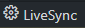
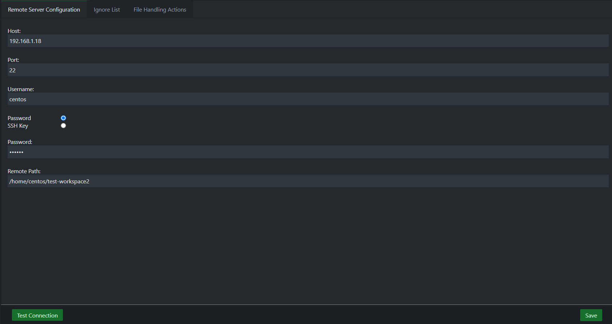

# LiveSync

**LiveSync** is a Visual Studio Code extension that allows you to **synchronize a local folder (the current workspace) with a remote folder**.  
It provides **flexible event-based sync rules**, allowing you to define how file operations (create, delete, rename, open, save) should be handled on the remote server.

LiveSync **shows real-time differences** between local and remote files in the **Tree View**, provides **quick sync actions**, and offers **seamless configuration** via the **Configuration Panel** or `.vscode/settings.json`.

---

## 🌟 Features

✔ **Two-Way Sync (Manual & Event-Based)** – Define sync rules for file creation, deletion, renaming, opening, and saving.  
✔ **Customizable Sync Rules** – Handle events with `check`, `check & event`, `event`, or `none` options.  
✔ **File & Folder Syncing** – Upload/download individual files or entire directories.  
✔ **Live Difference Tracking** – Tree view displays differences between local and remote.  
✔ **Explorer Context Menu Integration** – Right-click on files or folders to sync directly.  
✔ **Ignore Rules** – Use glob patterns to exclude files or folders.  
✔ **Multiple Refresh & View Options** – Switch between Tree/List view, show/hide unchanged files, and refresh differences.  
✔ **Seamless Configuration** – Set up via **LiveSync's Configuration Panel** or `.vscode/settings.json`.

---

## 📌 Installation

1. **Install VS Code** – Download [Visual Studio Code](https://code.visualstudio.com/).
2. **Install LiveSync Extension**:
   - Open **VS Code**.
   - Go to **Extensions** (`Ctrl+Shift+X` / `Cmd+Shift+X` on Mac).
   - Search for **LiveSync** and click **Install**.

---

## ⚙️ Configuration

#### **Option 1: Use the Configuration Panel (Recommended)**

LiveSync provides an easy-to-use configuration panel where you can set up your connection without manually editing JSON files.

##### **How to Open the Configuration Panel:**

1. **Via the Command Palette** (`Ctrl+Shift+P` or `Cmd+Shift+P` on Mac)
   - Search for **LiveSync: Open Configuration Panel** and select it.
2. **Via the Status Bar**
   - Click the **LiveSync** icon in the **VS Code status bar** (bottom left).

📷 **Example: Accessing Configuration Panel via Status Bar**<br>  


##### **How to Configure:**

1. Fill in your **remote server details** (hostname, port, username, authentication method, etc.).
2. (Optional) Click **Test Connection** to verify that the server is reachable.
3. Click on **Save** to apply the configuration.

📷 **Example: LiveSync Configuration Panel**<br>  


---

#### **Option 2: Manually Create the JSON Configuration**

If you prefer, you can manually configure LiveSync by editing `.vscode/settings.json`.

1. Open your workspace folder in VS Code.
2. Navigate to `.vscode/settings.json` (or create it if it doesn’t exist).
3. Add the following configuration:

```json
{
  "LiveSync.hostname": "your.server.com",
  "LiveSync.port": 22,
  "LiveSync.username": "your-username",
  "LiveSync.authMethod": "auth-sshKey", // or "auth-password"
  "LiveSync.privateKeyPath": "/path/to/private/key", // If using SSH key authentication
  "LiveSync.remotePath": "/remote/path/to/sync",
  "LiveSync.ignoreList": [".vscode", ".git", "node_modules"],

  "LiveSync.actionOnUpload": "check&upload",
  "LiveSync.actionOnDownload": "check&download",
  "LiveSync.actionOnSave": "check&save",
  "LiveSync.actionOnDelete": "none",
  "LiveSync.actionOnMove": "check&move",
  "LiveSync.actionOnCreate": "create",
  "LiveSync.actionOnOpen": "check&download"
}
```

---

## 🌳 LiveSync Tree View

Once your configuration is set up, LiveSync provides a **Tree View** in the VS Code Explorer. This view helps you **visualize differences between local and remote files**, making it easy to manage synchronization.

📷 **Example: LiveSync Tree View**<br>


#### **Features and Actions in the Tree View**

- **📄 Compare Local and Remote Files**

  - Click on a file to **open a diff view** showing changes between local and remote versions.

- **⬆ Upload / ⬇ Download**

  - Right-click any file or folder to **manually upload or download** between local and remote.

- **🔄 Refresh Differences**

  - Click the **Refresh** button at the top to **re-scan and update the differences**.

- **📂 Toggle Between Tree and List View**

  - Switch between a **hierarchical folder structure (Tree)** and a **flat file list (List)** for better readability.

- **👁 Hide/Show Unchanged Files**

  - Toggle visibility for files that **haven't changed**, keeping the view clean.

- **📉 Collapse All Folders**
  - Quickly **collapse all expanded folders** to declutter the view.

---
