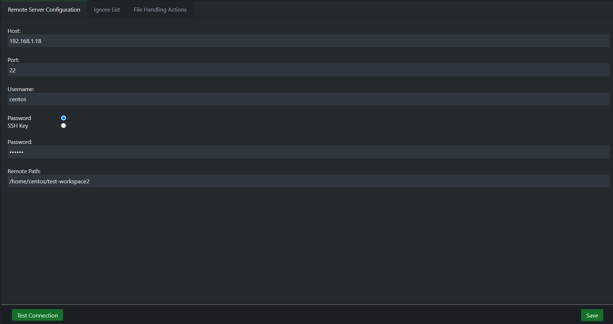
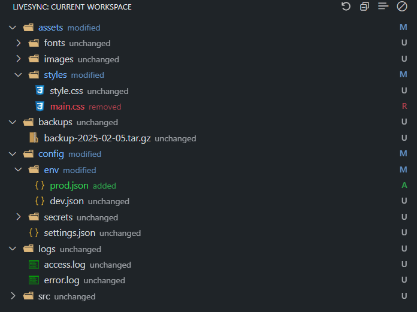

# LiveSync

**LiveSync** is a Visual Studio Code extension that lets you **instantly sync your local workspace with a remote folder over SSH/SFTP** — with **real-time difference tracking**, **customizable sync events**, and an **intuitive visual interface**.

It’s perfect for developers working with remote servers or any SSH-accessible machine.  
No more manual uploads, terminal back-and-forth, wondering if a file is out of sync or not notice when someone else changed a file on the VM.

---

## ⚡ Features at a Glance

- 🟢 **Live Difference View** – Visualize what’s changed between local and remote at a glance.
- 🔁 **Two-Way Sync Options** – Choose whether to sync on file create, save, delete, move, etc.
- ⚙️ **Flexible Event Rules** – Set each event to trigger `check`, `upload`, `download`, or do nothing.
- 📂 **Folder & File Sync** – Manually upload/download files or entire directories.
- 🧩 **Ignore Patterns** – Use glob-style rules to exclude `node_modules`, `.git`, etc.
- 🖱️ **Context Menu Integration** – Sync directly from the file explorer via right-click.
- 🌲 **Tree/List Views** – Choose how to visualize and act on changed files.
- 🎛️ **Visual Configuration Panel** – Set up without touching JSON files (but you still can).
- 🎨 Multi-Workspace - Independent configs per workspace folder

---

## 🚀 Quick Start

### 1. Install the Extension

- Open **VS Code**
- Go to **Extensions** (`Ctrl+Shift+X` / `Cmd+Shift+X`)
- Search for **LiveSync**
- Click **Install**

### 2. Set Up Your Connection

- Open the Command Palette (`Ctrl+Shift+P` / `Cmd+Shift+P`)
- Run: `LiveSync: Open Configuration Panel`
- Fill in your SSH/SFTP info
- Click **Test Connection** → then **Save**

📸 _Example:_  


### 3. Start Syncing

- Open the **LiveSync Tree View** in the sidebar
- Right-click a file or folder → **Upload**, **Download**, or **Show Diff**
- Toggle between tree/list view, hide unchanged files, or refresh diffs

📸 _Example:_  


---

## ⚙️ Configuration Options

LiveSync is configured per workspace folder, either through a visual interface or a dedicated JSON file.

### Option 1: Use the Configuration Command

The configuration panel is the easiest way to get started — no need to edit files manually.

**How to access it:**

- Open the Command Palette → `LiveSync: Configure Workspace`
- Or click the **LiveSync icon** in the status bar (bottom-left corner)

📸 _Example:_  


If you are working in a **multi-root workspace**, LiveSync will first ask you to select the workspace folder you want to configure.

After that, LiveSync will open either:
- the visual configuration panel (webview), or
- the raw configuration file (`.vscode/livesync.json`)

This behavior is controlled by the VS Code setting `livesync.openMode`, which lets you:
- always open the UI,
- always open the JSON file,
- or be prompted to choose each time.

---

### Option 2: Manual `.vscode/livesync.json` Setup

If you prefer to create or edit the configuration manually, LiveSync stores its workspace configuration in:

`.vscode/livesync.json`

Example:

```json
{
  "hostname": "your.server.com",
  "port": 2222,
  "username": "your-username",
  "password": "your-password",
  "privateKeyPath": "/path/to/private/key",
  "passphrase": "",
  "remotePath": "/remote/path/to/sync",

  "actionOnUpload": "check&upload",
  "actionOnDownload": "check&download",
  "actionOnSave": "check&save",
  "actionOnCreate": "check",
  "actionOnDelete": "check",
  "actionOnMove": "check&move",
  "actionOnOpen": "check&download",

  "ignoreList": [
    ".vscode",
    ".svn",
    ".git"
  ]
}
```

---

## 🌳 Tree View Features

LiveSync’s Tree View helps you **visualize and manage file differences** between local and remote folders.

### Available Actions:

- **📄 View Diffs** – Click a file to see the local vs. remote difference
- **⬆ Upload / ⬇ Download** – Right-click files or folders to sync manually
- **🔄 Refresh Differences** – Re-scan the current project to update changes
- **📁 Tree vs. List View** – Choose how you browse files (hierarchical or flat)
- **👁 Hide/Show Unchanged Files** – Clean up the view for faster triaging
- **📉 Collapse All** – Quickly collapse the entire folder tree

---

## 💡 Tips & Troubleshooting

- Works best with stable SSH/SFTP connections (slow networks may cause delays)
- You can mix event-based and manual sync as needed
- If something isn’t syncing right, check the **Output Panel** for logs

---

## 📣 Contribute or Report Issues

Found a bug or have a feature idea?  
Open an issue on GitHub: [LiveSync Issues](https://github.com/a-gior/LiveSync/issues)

---

## 📌 License

This extension is licensed under the GPT-3 License.  
See [LICENSE](./LICENSE) for details.

---
